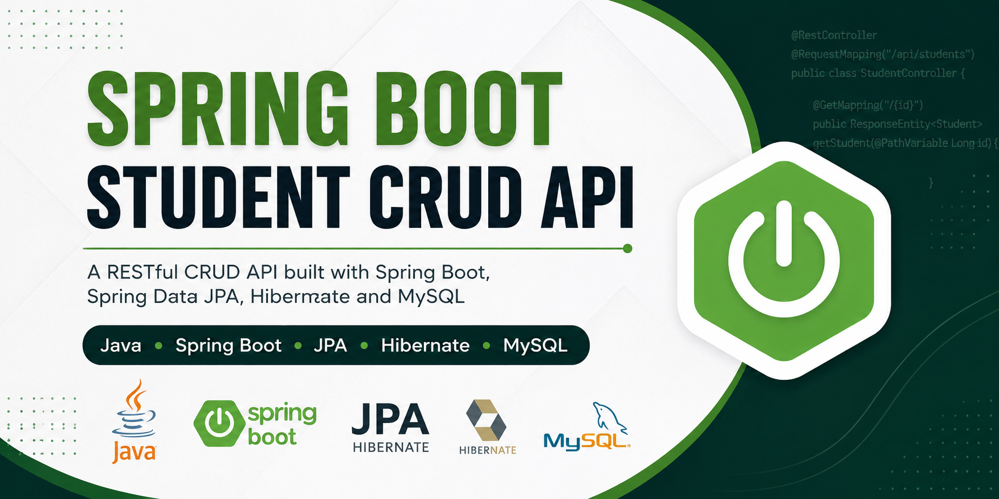

<p align="center">
  
</p>


# 🎓  Spring Boot Student CRUD REST API | Java + Spring Data JPA + MySQL || Spring Boot Student CRUD REST API using Java, Spring Data JPA, Hibernate, MySQL, Maven and Postman with layered architecture.

A RESTful CRUD API built using **Spring Boot**, **Spring Data JPA**, and **MySQL**. This project demonstrates a layered architecture (Controller → Service → Repository) and performs complete CRUD operations on student records.

---

## 🚀 Features

- ✅ Create Student
- ✅ Get Student by ID
- ✅ Get All Students
- ✅ Update Student
- ✅ Delete Student
- ✅ Soft Delete Student
- ✅ MySQL Database Integration
- ✅ Spring Data JPA
- ✅ RESTful APIs
- ✅ JSON Request/Response
- ✅ Layered Architecture

---

## 🛠️ Tech Stack

- Java 21/26
- Spring Boot
- Spring Data JPA
- Hibernate
- MySQL
- Maven
- Postman
- IntelliJ IDEA
- spring-boot
- java
- rest-api
- crud
- spring-data-jpa
- hibernate
- mysql
- maven
- backend
- student-management-system
- postman
- api
- java-project
---

## 📂 Project Structure

```
src
├── main
│   ├── java
│   │   └── com.springbootweb.springbootApplicationweb
│   │       ├── controller
│   │       ├── service
│   │       ├── repository
│   │       ├── entity
│   │       └── SpringbootApplicationwebApplication.java
│   └── resources
│       └── application.properties
```

---

## ⚙️ Database Configuration

Update `application.properties`:

```properties
spring.datasource.url=jdbc:mysql://localhost:3306/student_crud_db
spring.datasource.username=root
spring.datasource.password=YOUR_PASSWORD

spring.jpa.hibernate.ddl-auto=update
spring.jpa.show-sql=true
spring.jpa.properties.hibernate.format_sql=true
```

---

## 📌 REST API Endpoints

### Create Student

```
POST /api/students/create
```

Request Body

```json
{
  "name": "Ankit Shukla",
  "email": "ankit.shukla@gmail.com",
  "age": 22,
  "rollNo": 101,
  "subject": "Spring Boot"
}
```

---

### Get Student

```
GET /api/students/get/{id}
```

---

### Get All Students

```
GET /api/students/getAll
```

---

### Update Student

```
PUT /api/students/update/{id}
```

---

### Delete Student

```
DELETE /api/students/deleted/{id}
```

---
### DeleteAll Student

```
DELETE /api/students/deleteall
```

---
## 🗑️ Soft Delete Feature

This project supports **Soft Delete**, which marks a student as deleted instead of permanently removing the record from the database.

### How it Works

- A new `deleted` field is added to the `Student` entity.
- When a student is soft deleted, the `deleted` flag is updated to `true`.
- Soft-deleted students are automatically excluded from all fetch operations.
- The data remains stored in the database and can be restored in the future if needed.

### Soft Delete API

| Method | Endpoint | Description |
|--------|----------|-------------|
| PATCH | `/api/students/delete-soft/{id}` | Soft delete a student by ID |

### Example Response

```text
Student soft deleted successfully.
```

### Database Example

| id | name | deleted |
|----|------|---------|
| 1 | Ankit Shukla | false |
| 2 | Rahul Sharma | true |

> **Note:** Records with `deleted = true` are hidden from the Get Student and Get All Students APIs.

## 🗄️ Database Schema

| Column | Type |
|---------|------|
| id | BIGINT (AUTO_INCREMENT) |
| name | VARCHAR(255) |
| email | VARCHAR(255) |
| age | INT |
| roll_no | INT |
| subject | VARCHAR(255) |

---

## ▶️ Running the Project

Clone the repository

```bash
git clone https://github.com/Ankitshukla63/springboot-student-crud.git
```

Go to the project directory

```bash
cd springboot-student-crud
```

Run the application

```bash
mvn spring-boot:run
```

The application starts at

```
http://localhost:8080
```

---

## 🧪 Testing

The APIs can be tested using:

- Postman
- Thunder Client
- curl

---

## 📈 Future Improvements

- DTO Pattern
- Validation using `@Valid`
- Global Exception Handling
- Pagination & Sorting
- Search APIs
- Swagger/OpenAPI Documentation
- Unit & Integration Testing
- Docker Support
- Spring Security with JWT

---

## 👨‍💻 Author

**Ankit Shukla**

GitHub: https://github.com/Ankitshukla63

LinkedIn: *(Add your LinkedIn profile here)*

---
⭐ If you found this project useful, consider giving it a star!
